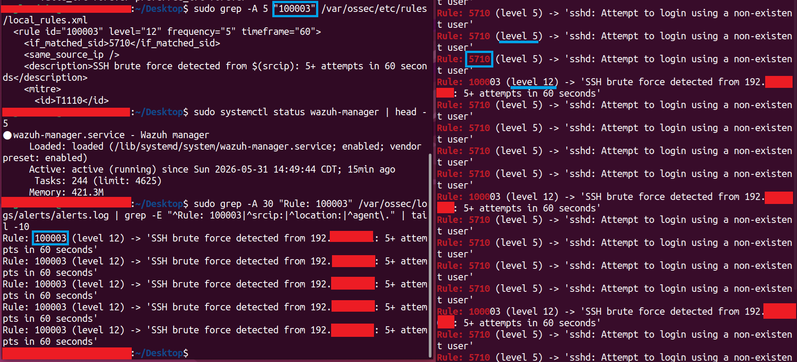

# SSH Brute Force Detection — Kali Attacker + Hydra + Wazuh

**Project:** P1 — Wazuh SIEM Home Lab
**Phase:** 1b | **Platform:** Hyper-V on Windows 11 Pro
**MITRE ATT&CK:** T1110 — Brute Force / T1110.001 — Password Guessing
**Cert Alignment:** CySA+ CS0-004, SC-200
**Date Completed:** May 2026

---

## Scenario

Lab 1 covered endpoint-level detection: a Windows agent forwarding failed logon events to Wazuh, one event triggering one alert. Lab 1b shifts the target. A Kali attacker VM runs Hydra against the Ubuntu Wazuh manager's SSH service, and Wazuh catches it — not from a single event, but from a frequency pattern. Five failed attempts from the same source IP in sixty seconds fires the custom rule.

The distinction matters for building real detection depth. Endpoint detection reacts to what happened on a host. Network-layer brute force detection reacts to behavior over time. Both map to T1110, but they're different sub-techniques, different log sources, and different rule architectures. Together they show detection coverage across attack surfaces, not just a single event type.

---

## Architecture

```
[Kali Linux VM — Attacker]              [Ubuntu 22.04 VM — SIEM Manager + Target]
  Attacker VM                              Wazuh Manager v4.14.5-1
  LabInternal static IP      ──────────►  LabInternal static IP
                                            sshd (port 22)
  Hydra SSH brute force ──────────────►  Rule 5710 feeds Rule 100003
```

> Real IPs, hostnames, and usernames are omitted from this write-up per standard home lab portfolio security practice.

**Network:** LabInternal isolated Hyper-V switch, static IPs on both VMs. Same isolated subnet used for Wazuh agent-manager communication in Lab 1.

---

## What I Built

### 1. Kali Attacker VM Connected to LabInternal

The attacker VM was connected to the LabInternal virtual switch by adding a second network adapter in Hyper-V Manager and assigning it to the LabInternal switch. A static IP was assigned on the new interface:

```bash
sudo ip addr add <attacker-ip>/24 dev eth1
sudo ip link set eth1 up
```

Connectivity to the Wazuh manager was confirmed with a ping test before proceeding.

**Note from setup:** Adding a NIC to a running Hyper-V VM isn't enough on its own. The NIC shows `NO-CARRIER` until the virtual switch is explicitly assigned in VM settings. The IP configuration in Linux doesn't matter until that Hyper-V step is done first.

### 2. SSH Service Installed on the Ubuntu Manager

The Ubuntu Wazuh manager didn't have OpenSSH server installed; the base Wazuh install doesn't require it. Installing it made the manager a realistic SSH target for the brute force simulation.

```bash
sudo apt install -y openssh-server
sudo systemctl enable --now ssh
```

Confirmed listening on `0.0.0.0:22`.

### 3. Custom Brute Force Detection Rule (Rule 100003)

Wazuh's built-in SSH ruleset (`0095-sshd_rules.xml`) already includes:

- **Rule 5710** (level 5): SSH login attempt using a non-existent user
- **Rule 5712** (level 10): SSH brute force — 8 failed attempts in 120 seconds, same source IP

I wrote a custom rule in `/var/ossec/etc/rules/local_rules.xml` to fire at a lower threshold, with explicit MITRE T1110.001 tagging:

```xml
<group name="local,syslog,sshd,">
  <rule id="100003" level="12" frequency="5" timeframe="60">
    <if_matched_sid>5710</if_matched_sid>
    <same_source_ip />
    <description>SSH brute force detected from $(srcip): 5+ attempts in 60 seconds</description>
    <mitre>
      <id>T1110</id>
      <id>T1110.001</id>
    </mitre>
  </rule>
</group>
```

Key decisions in the rule:

- **Rule ID 100003:** Continues the custom rule sequence from Lab 1 (100002 = Event 4625). No collision with existing IDs.
- **Parent rule 5710:** Targets auth failures against non-existent usernames, which is exactly what Hydra generates with a fabricated login.
- **Frequency 5, timeframe 60:** Lower than the built-in rule 5712 (8 attempts, 120 seconds). Fine for a lab environment; in production this threshold would need tuning against baseline SSH failure rates.
- **`<same_source_ip />`:** Correlates attempts from the same attacker address. Without it, the frequency counter aggregates across all sources and the rule becomes much noisier.
- **Level 12:** Higher than the built-in rule 5712 (level 10) to mark this as a prioritized custom detection.

```bash
sudo systemctl restart wazuh-manager
```

---

## What I Detected

From the attacker VM, I ran Hydra targeting the manager's SSH service:

```bash
hydra -l baduser -p badpass <manager-ip> ssh
```

I ran this six times in quick succession. Each run generated one SSH auth failure, triggering rule 5710. After the fifth attempt inside the sixty-second window, rule 100003 fired.

Confirmed in `/var/ossec/logs/alerts/alerts.log`:

```
Rule: 5710 (level 5) -> 'sshd: Attempt to login using a non-existent user'
Rule: 5710 (level 5) -> 'sshd: Attempt to login using a non-existent user'
Rule: 5710 (level 5) -> 'sshd: Attempt to login using a non-existent user'
Rule: 5710 (level 5) -> 'sshd: Attempt to login using a non-existent user'
Rule: 5710 (level 5) -> 'sshd: Attempt to login using a non-existent user'
Rule: 100003 (level 12) -> 'SSH brute force detected from <attacker-ip>: 5+ attempts in 60 seconds'
```

Rule 100003 continued firing with each subsequent set of five attempts.



---

## What I Learned

**Multi-NIC routing changes source IP attribution.** The attacker VM had two interfaces: eth0 on the Default Switch for internet access, and eth1 on LabInternal for lab traffic. After assigning the LabInternal IP to eth1, the routing table still preferred eth0 as the default gateway. Hydra routed its traffic through the Default Switch NAT instead of directly through eth1, so the attacks appeared to originate from the host machine's LabInternal address rather than the attacker VM's dedicated IP. The detection still fired correctly; rule 100003 doesn't depend on a specific source address, only on frequency from a consistent source. But source attribution was wrong, and that matters in a real investigation. The fix is either adding a specific static route to force LabInternal traffic through eth1, or removing the default gateway from eth0 entirely for lab use.

**Frequency-based detection requires stateful logic.** Lab 1's rule 100002 fires on a single event. Rule 100003 requires Wazuh to maintain a rolling count of events from the same source within a time window. If an attacker spreads attempts across the window boundary or rotates source IPs, the rule doesn't fire. That's not a flaw; it's a design tradeoff. Threshold tuning and complementary rules covering single-event anomalies are both part of a complete detection strategy.

**Custom rules that depend on built-in rules inherit their dependencies.** Rule 100003 only fires if rule 5710 fires first. If 5710 were suppressed or absent, 100003 would never trigger regardless of how many SSH failures occurred. Verifying the parent rule fires correctly is a necessary step before trusting the child rule's silence as a true negative.

**`NO-CARRIER` on a Hyper-V VM NIC means the virtual switch isn't connected.** Adding a NIC to a running VM and assigning it to a switch in Hyper-V settings are two separate operations. Until the switch assignment is applied, the NIC reports `NO-CARRIER` and no packets leave the VM regardless of what's configured on the Linux side.

---

## Lab Environment

| Component | Details |
|-----------|---------|
| Host | Windows 11 Pro, Hyper-V enabled |
| SIEM Manager / Target | Ubuntu 22.04 LTS, Wazuh v4.14.5-1, OpenSSH server |
| Attacker VM | Kali Linux, Hydra v9.6, LabInternal static IP |
| Network | Isolated internal Hyper-V switch, static IPs |

---

## Up Next

- **P1 Add-On:** Sysmon for Linux on the Wazuh manager VM — enhances process, network, and file event telemetry.
- **Lab 2:** Microsoft Sentinel + KQL Detection Engineering; Azure free tenant, Log Analytics Workspace, first analytic rule.

---

*Part of the [cloud-security-lab-notes](https://github.com/JNewbrey87/cloud-security-lab-notes) portfolio, building toward Cloud Security Analyst and SC-200/CySA+/SC-500 certifications.*
