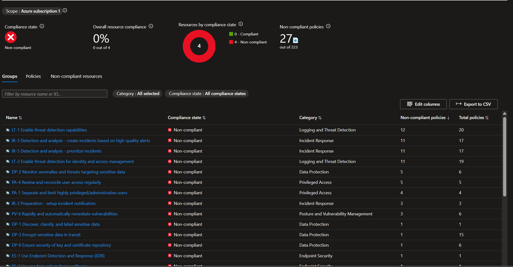
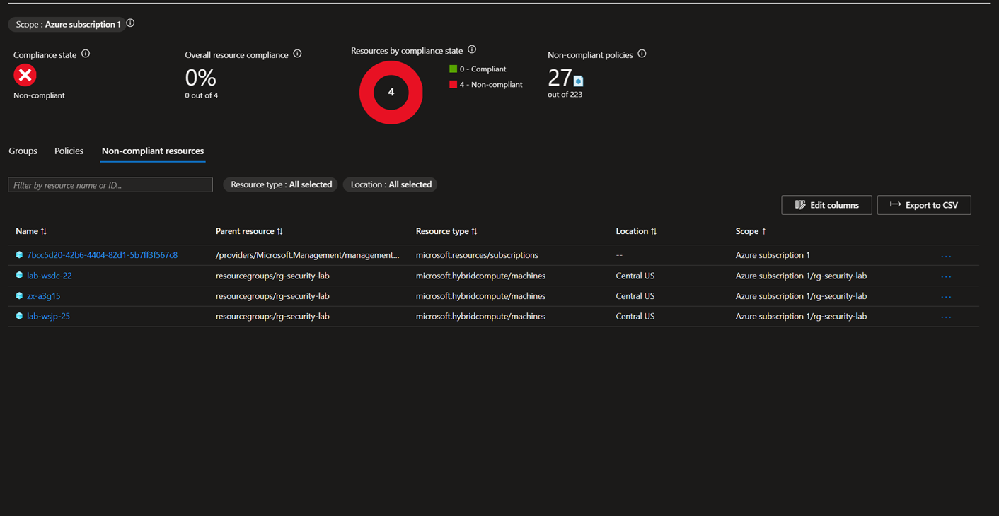
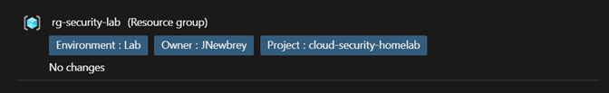

# Azure Arc Onboarding + MCSB Baseline Assessment

**Project:** P2 — Azure Integration and Cloud Detection Engineering
**Phase:** 2-1a | **Platform:** Azure Arc (hybrid), VirtualBox on Windows 11 Pro
**MITRE ATT&CK:** [T1078 — Valid Accounts](https://attack.mitre.org/techniques/T1078/) / [T1562 — Impair Defenses](https://attack.mitre.org/techniques/T1562/) (via MCSB control coverage)
**Cert Alignment:** CySA+ CS0-003, SC-200, SC-500
**Date Completed:** June 2026

---

## Scenario

Phase 1 built a fully validated on-prem detection stack: four custom Wazuh rules, three active agents, and a two-stage brute-force-to-lateral-movement kill chain confirmed end-to-end. Every rule fired. Every event was traceable. Phase 1 is done.

Phase 2 extends the same lab environment into Azure without migrating anything. Azure Arc brings on-prem and hosted machines under unified Azure management — the Arc agent runs on each VM and registers it as a `microsoft.hybridcompute/machines` resource. Once registered, those machines become targets for Azure Policy, Defender for Cloud assessments, Microsoft Sentinel data connectors, and the full suite of cloud-native security tooling.

This lab covers the Phase 2 foundation: Arc onboarding for all three lab machines, resource governance tagging, Microsoft Cloud Security Benchmark (MCSB) baseline policy assignment, Microsoft Entra ID posture review, and the debugging insight that Defender for Cloud's Inventory UI is not the ground truth for Arc machines in a partial-trial subscription state.

---

## Architecture

```
[ZX-A3G15 — Windows 11 Pro]    [LAB-WSJP-25 — Tier 1 Jump Box]    [LAB-WSDC-22 — Tier 0 DC]
 192.168.10.1 (host)             192.168.10.60, Win Server 2025       192.168.10.50, Win Server 2022
 Arc agent v1.65 (001)           Arc agent v1.65 (002)                Arc agent v1.65 (003)
         |                                |                                    |
         +--------------------------------+------------------------------------+
                                          |
                               [Azure Arc — rg-security-lab]
                               Region: Central US
                               Resource type: microsoft.hybridcompute/machines
                                          |
                    +---------------------+---------------------+
                    |                                           |
         [Azure Policy]                              [Microsoft Entra ID]
         Guest Configuration prerequisite            Identity Secure Score: 68.42%
         MCSB baseline (MCSB v2.*.*)                 5 security recommendations
         0% compliance — expected baseline            Single GA user
```

> All VMs remain on the isolated host-only VirtualBox network (192.168.10.0/24) for Wazuh lab work. Arc connectivity uses the NAT adapter on each VM for outbound Azure communication — Arc does not expose lab machines to the internet.

---

## What I Built

### 1. Azure Arc Onboarding — All Three Lab Machines

Arc agent version 1.65.03439.3010 was deployed to each machine using the onboarding script generated from Azure Arc → Servers → Add a single server. All three connected to resource group `rg-security-lab` in Central US.

| Machine | Role | Arc Status |
|---------|------|-----------|
| LAB-WSJP-25 | Tier 1 jump box, Windows Server 2025 | Connected |
| ZX-A3G15 | VirtualBox host, Windows 11 Pro | Connected |
| LAB-WSDC-22 | Tier 0 DC, Windows Server 2022 | Connected |

**On each machine (elevated PowerShell):**

```powershell
Set-ExecutionPolicy Bypass -Scope Process -Force
.\ArcOnboardingScript.ps1
# A device-code login prompt appears — authenticate as the Azure account owner
```

After sign-in, the Arc service (`himds` — Hybrid Instance Metadata Service) starts and registers the machine. Verify on the machine:

```powershell
Get-Service himds | Select-Object Name, Status
# Expected: Running
```

Verify in the portal: Azure Arc → Servers → all three machines show **Connected**.

**Key decision:** ZX-A3G15 (the VirtualBox host itself) was also onboarded. This is intentional — it's running as Wazuh agent 001 and is already part of the detection pipeline. Having it visible in Azure alongside the lab VMs gives a complete picture of the Arc-connected fleet. It is still permanently excluded as a lab attack target.

---

### 2. Resource Group Tagging

Standard governance tags applied to `rg-security-lab`:

| Tag | Value |
|-----|-------|
| `Environment` | `Lab` |
| `Owner` | `JNewbrey` |
| `Project` | `cloud-security-homelab` |

Tags applied at the resource group level are inherited by all resources in the group, meaning all three Arc-connected machines and future resources in `rg-security-lab` carry these tags for filtering, reporting, and cost attribution.

**In the portal:** Resource Groups → rg-security-lab → Tags → add all three → Save.

This is a small step with disproportionate value during an audit or a job interview: it shows that governance hygiene was applied from the start, not retrofitted after the fact.

---

### 3. Azure Policy Assignments — MCSB Baseline

Two policy assignments were made at the `rg-security-lab` scope:

**Assignment 1 — Guest Configuration prerequisite initiative**

Deploys the managed identity and Windows Guest Configuration extension to each Arc machine. This is a prerequisite for any policy that reads machine configuration state (compliance settings, audit policies, etc.). Role assignments were created successfully during deployment.

**Assignment 2 — Windows machines should meet requirements of the Azure compute security baseline**

The Microsoft Cloud Security Benchmark (MCSB), version 2, applied to Azure subscription 1. This is the Azure-native equivalent of CIS Benchmarks — it evaluates machine configuration against 223 security policies across control families including logging, incident response, privileged access, data protection, and endpoint security.

**In the portal:** Azure Policy → Assignments → Assign policy → select scope → find "Windows machines should meet requirements of the Azure compute security baseline."

---

### 4. Microsoft Entra ID Posture Review

Reviewed the Entra ID tenant's security posture after Arc onboarding. Baseline state:

- **Identity Secure Score:** 68.42%
- **Security recommendations:** 5 active (all free tier)
- **Notable finding:** "Do not expire passwords" flagged as High severity, 8/8 users impacted — intentionally left as-is for a solo lab environment; enforcing password expiration on a single-user tenant would add friction with no real security benefit
- **License:** Microsoft Entra ID Free
- **Users:** Single Global Administrator (Joshua Newbrey)

---

## What I Observed

### MCSB Baseline Assessment Results

After policy propagation, the Policy Compliance dashboard showed the expected baseline state: 0% compliance across all four assessed resources.



**Overall:** 0 out of 4 resources compliant. 27 non-compliant policies out of 223 total.

**Non-compliant control families (by policy count):**

| Control ID | Name | Category | Non-compliant / Total |
|-----------|------|----------|----------------------|
| IT-1 | Enable threat detection capabilities | Logging and Threat Detection | 12 / 20 |
| IR-1 | Detection and analysis: create incidents | Incident Response | 11 / 17 |
| IR-5 | Detection and analysis: prioritize incidents | Incident Response | 11 / 17 |
| IT-2 | Enable threat detection for identity and access management | Logging and Threat Detection | 11 / 19 |
| DP-2 | Monitor anomalies targeting sensitive data | Data Protection | 5 / 6 |
| PA-4 | Review and reconcile user access regularly | Privileged Access | 5 / 5 |
| PA-1 | Separate and limit highly privileged users | Privileged Access | 4 / 4 |
| IR-2 | Preparation: setup incident notification | Incident Response | 3 / 3 |
| PV-6 | Rapidly and automatically remediate vulnerabilities | Posture and Vulnerability Management | 3 / 6 |
| ES-1 | Use Endpoint Detection and Response (EDR) | Endpoint Security | 1 / 1 |

**0% is the correct expected baseline.** These machines have no hardening applied, no logging configured beyond Wazuh, no Defender for Endpoint, no Sentinel workspace. Every non-compliant policy is a documented gap to close over the next lab phases — not an error.

---

### Non-Compliant Resources Confirmed



Four non-compliant resources listed:

1. `microsoft.resources/subscriptions` — the Azure subscription itself
2. `lab-wsdc-22` — `microsoft.hybridcompute/machines`, Central US, rg-security-lab
3. `zx-a3g15` — `microsoft.hybridcompute/machines`, Central US, rg-security-lab
4. `lab-wsjp-25` — `microsoft.hybridcompute/machines`, Central US, rg-security-lab

The `microsoft.hybridcompute/machines` resource type is the confirmation that Arc onboarding succeeded. These are not native Azure VMs — they are on-prem machines managed through Arc, which is exactly what was intended.

---

### Resource Group Tags Confirmed



All three tags saved successfully with no pending changes.

---

### Defender for Cloud Inventory — UI Limitation

Defender for Cloud Inventory showed 0 assessed resources at the time of review. This looked like a scan failure but is not.

**Root cause:** The subscription is in a "Trial expired - Partial" state, which causes the Inventory UI to display incorrectly. The underlying MCSB assessment is running — the Policy Compliance dashboard confirmed all three Arc machines are being evaluated. The Inventory view is the broken surface, not the scan engine.

**Practical takeaway:** When troubleshooting Defender for Cloud in a free/partial subscription state, use Azure Policy → Compliance as the ground truth for Arc machine assessment status. Inventory is unreliable in this state.

---

## What I Learned

**Azure Policy Compliance is the ground truth for Arc machines, not Defender for Cloud Inventory.** The Inventory UI failing silently in a partial-trial subscription state looks exactly like a failed Arc onboarding or a misconfigured policy assignment. The Policy Compliance view — filtering by `microsoft.hybridcompute/machines` resource type — is what confirmed the scan was running. This distinction matters: in a production environment, a silent UI failure like this is the kind of thing that creates a false sense of security. The correct response is to verify at the policy layer, not accept the Inventory count as definitive.

**The MCSB control family breakdown reveals where cloud-native detection gaps are most concentrated.** IT-1 and IT-2 together represent 23 logging and threat detection policies, almost all non-compliant. IR-1 and IR-5 represent another 34 incident response policies. This is not a coincidence: MCSB is built around the assumption that most enterprises have a detection and response gap, not a firewall or access-control gap. The framework weights logging, monitoring, and incident response the heaviest. Phase 2 lab work (Sentinel, KQL detection rules, data connectors) will close the IT-1 and IR-1 families first — those are the most policy-dense and the most directly relevant to detection engineering.

**Resource tagging at the resource group level should happen at setup, not retrospectively.** Applying `Environment`, `Owner`, and `Project` tags before adding resources means every resource in the group inherits them automatically. Doing this after the fact — with dozens of resources already deployed — means hunting down each resource individually. The tags themselves are unremarkable; the timing is the discipline.

**Arc registers on-prem machines under Azure management without migrating or exposing them.** The `microsoft.hybridcompute/machines` resource type is the key: these are not VMs running in Azure datacenters. They are lab VMs running on a local VirtualBox host, registered with Azure management plane through the Arc agent's outbound HTTPS connection. Azure Policy can evaluate them, Defender for Cloud can assess them, and Sentinel can eventually ingest their logs — all without any inbound connectivity to the lab network.

---

## Lab Environment

| Component | Details |
|-----------|---------|
| VirtualBox Host | ZX-A3G15, Windows 11 Pro, VirtualBox 7 |
| Lab Network | Isolated host-only (192.168.10.0/24, no external exposure) |
| Arc machines | LAB-WSDC-22 (Server 2022), LAB-WSJP-25 (Server 2025), ZX-A3G15 (Windows 11 Pro) |
| Azure resource group | rg-security-lab, Central US |
| Arc agent version | v1.65.03439.3010 |
| Azure Policy scope | Azure subscription 1 (MCSB baseline + Guest Config) |
| Entra ID | Free tier, single GA user, Identity Secure Score 68.42% |

---

## Up Next

- **Microsoft Sentinel:** Activate the 31-day free trial on a new Log Analytics Workspace; connect the Windows Security Events data connector; verify Phase 1 kill chain events are flowing. Calendar reminder set for approximately July 25 (3-day buffer before day 31). See `00-LAB-P2-1b.md`.
- **KQL detection rules:** Translate Wazuh custom rules 100002, 100004, and 100005 into KQL analytic rules in Sentinel — the same kill chain, now visible in the cloud-native SIEM.
- **Rule 100003 (SSH brute force) re-validation:** `PerSourcePenalties no` fix pending on LAB-UBTU before next Hydra run.

---

*Part of the [cloud-security-lab-notes](https://github.com/JNewbrey87/cloud-security-lab-notes) portfolio, building toward Cloud Security Analyst and SC-200/CySA+/SC-500 certifications.*
