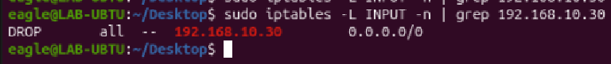
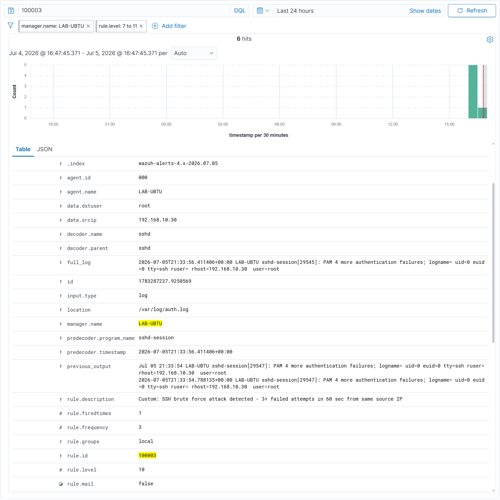

# SSH Brute Force Detection + Active Response — Ubuntu 25.04, PAM Log Path

**Project:** P2 — Azure Integration and Cloud Detection Engineering
**Phase:** 2-1b | **Platform:** VirtualBox on Windows 11 Pro (ZX-A3G15)
**MITRE ATT&CK:** [T1110 — Brute Force](https://attack.mitre.org/techniques/T1110/) / [T1110.001 — Password Guessing](https://attack.mitre.org/techniques/T1110.001/) / [T1136.001 — Create Account: Local Account](https://attack.mitre.org/techniques/T1136/001/) / [T1543.003 — Windows Service](https://attack.mitre.org/techniques/T1543/003/)
**Cert Alignment:** CySA+ CS0-004, SC-200
**Date Completed:** July 2026

---

## Scenario

Lab 1b validated SSH brute force detection on Ubuntu 22.04 under Hyper-V, with rule 100003 keyed off rule 5700 — the standard Wazuh decoder for sshd authentication failures. Phase 2 moved the lab to VirtualBox on ZX-A3G15, and the detection silently stopped working.

Ubuntu 25.04 ships with `sshd-session` as the process that handles authentication. Unlike the classic `sshd` process, `sshd-session` routes failed authentication through the PAM subsystem. PAM failure events decode differently in Wazuh — they hit rule 2502 ("User missed the password more than one time"), not the sshd rules (5700, 5710) that rule 100003 was built on. Hydra ran cleanly. Wazuh saw nothing.

This lab re-establishes SSH brute force detection on the current platform, resolves the log path mismatch with a diagnostic-first approach via `wazuh-logtest`, and adds automated countermeasures via Wazuh Active Response. Three additional Windows detection rules covering persistence and account lockout were written in parallel during the same session.

---

## Architecture

```
[LAB-KALI — Attacker]                   [LAB-UBTU — Wazuh Manager + SSH Target]
  192.168.10.30                            192.168.10.10, Ubuntu 25.04
  Hydra SSH brute force  ──────────────►   sshd-session → PAM → rule 2502
                                                 │
                                           Rule 100009 (single failure, rhost= field)
                                                 │
                                           Rule 100003 (3+ hits, 60s, same IP)
                                                 │
                                        Active Response: firewall-drop, 180s timeout
  LAB-KALI BLOCKED ◄──────────────────── iptables DROP → 192.168.10.30
```

> All VMs run on an isolated host-only VirtualBox network. The 192.168.10.x addresses are not externally reachable. Real usernames and wordlist paths are omitted.

---

## What I Built

### 1. Diagnosed the Ubuntu 25.04 Log Path Difference

The first symptom was that Hydra ran without triggering any Wazuh alerts. Two things were happening in combination.

**Problem 1 — PerSourcePenalties:** Ubuntu 25.04 sshd enables connection-rate penalties by default. When a source IP accumulates failed connections, subsequent connections are rejected at the transport layer before any authentication attempt is logged. No auth event, no PAM failure, no Wazuh event. Fix:

**In `/etc/ssh/sshd_config` on LAB-UBTU:**
```
PerSourcePenalties no
```

```bash
sudo systemctl restart ssh
```

**Problem 2 — sshd-session PAM log path:** With PerSourcePenalties disabled, Hydra's attempts now reach the authentication layer and generate PAM failure events. But those events do not match the sshd decoder chain that rule 5700 expects. To find the actual rule path, paste a real failure line from `/var/log/auth.log` into `wazuh-logtest`:

```bash
sudo /var/ossec/bin/wazuh-logtest
```

A sample PAM failure line looks like:
```
Jun  5 10:12:34 lab-ubtu sshd-session[1234]: pam_unix(sshd:auth): authentication failure; logname= uid=0 euid=0 tty=ssh ruser= rhost=192.168.10.30 user=testuser
```

`wazuh-logtest` resolves this to **rule 2502** — "User missed the password more than one time." Rule 5700 and rule 5710 never appear in the chain. This confirms the parent SID for rule 100003 must change from `5700` to `2502`.

---

### 2. Rule 100009 — Intermediate Single-Failure Decoder (Ubuntu 25.04 PAM Format)

Some PAM failure events on Ubuntu 25.04 include a `rhost=` field carrying the attacker's source IP in a format that maps to rule 5711. Rule 100009 captures this specific case — a single-failure event with explicit remote host attribution — as a supplementary decoder alongside rule 2502:

```xml
<!-- Rule 100009: SSH auth failure with remote host attribution (Ubuntu 25.04 PAM format) -->
<!-- Catches sshd-session PAM events where rhost= is present in the log line -->
<!-- Parent: rule 5711; match: rhost= field present -->
<!-- Acts as diagnostic supplement for the Ubuntu 25.04 PAM log path -->
<rule id="100009" level="5">
  <if_sid>5711</if_sid>
  <match>rhost=</match>
  <description>Custom: SSH auth failure with remote host attribution (PAM format, sshd-session, Ubuntu 25.04)</description>
  <mitre>
    <id>T1110</id>
  </mitre>
</rule>
```

---

### 3. Rule 100003 — Rebuilt for Ubuntu 25.04 PAM Log Path

Rule 100003 was rewritten to use rule 2502 as the parent SID. Frequency threshold lowered to 3 attempts (from 5 in Lab 1b) — appropriate for the isolated lab environment where false positives from legitimate SSH traffic are not a concern:

```xml
<!-- Rule 100003: SSH Brute Force — rebuilt for Ubuntu 25.04 PAM path -->
<!-- CRITICAL: Ubuntu 25.04 sshd-session fires rule 2502 (PAM), NOT rules 5700 or 5710 -->
<!-- Lab 1b used if_matched_sid=5700, valid for Ubuntu 22.04 / sshd process -->
<!-- Requires PerSourcePenalties no in /etc/ssh/sshd_config for Hydra to reach auth layer -->
<rule id="100003" level="10" frequency="3" timeframe="60">
  <if_matched_sid>2502</if_matched_sid>
  <same_source_ip />
  <description>Custom: SSH brute force detected: 3+ PAM auth failures in 60 sec from same source IP</description>
  <mitre>
    <id>T1110</id>
    <id>T1110.001</id>
  </mitre>
</rule>
```

```bash
sudo systemctl restart wazuh-manager
```

---

### 4. Windows Persistence and Account Monitoring Rules (100006, 100007, 100008)

Three rules added to `local_rules.xml` extending Windows coverage toward persistence detection. These complement the lateral movement rules (100004, 100005) validated in Lab 1d:

```xml
<!-- Rule 100006: New Windows local account created (Event 4720) -->
<!-- MITRE: T1136.001 — Create Account: Local Account -->
<!-- Fires when an attacker or script creates a new user account for persistence -->
<rule id="100006" level="12">
  <if_group>windows</if_group>
  <field name="win.system.eventID">^4720$</field>
  <description>Custom: Windows user account created (Event 4720) - possible persistence via local account</description>
  <mitre>
    <id>T1136.001</id>
  </mitre>
</rule>

<!-- Rule 100007: New Windows service installed (Event 7045) -->
<!-- MITRE: T1543.003 — Create or Modify System Process: Windows Service -->
<!-- Fires on service installation; useful for catching service-based persistence or privilege escalation -->
<rule id="100007" level="12">
  <if_group>windows</if_group>
  <field name="win.system.eventID">^7045$</field>
  <description>Custom: New Windows service installed (Event 7045) - possible persistence or privilege escalation</description>
  <mitre>
    <id>T1543.003</id>
  </mitre>
</rule>

<!-- Rule 100008: Windows account lockout (Event 4740) -->
<!-- MITRE: T1110 — Brute Force -->
<!-- Complements rule 100002 (Event 4625, single failure); 4740 fires after lockout threshold is crossed -->
<rule id="100008" level="10">
  <if_group>windows</if_group>
  <field name="win.system.eventID">^4740$</field>
  <description>Custom: Windows account lockout detected (Event 4740) - brute force indicator</description>
  <mitre>
    <id>T1110</id>
  </mitre>
</rule>
```

---

### 5. Wazuh Active Response — Automated Firewall Block on Rule 100003

Active Response configures Wazuh to execute a remediation script automatically when a specified rule fires. The `firewall-drop` command is built into Wazuh: it inserts an `iptables` DROP rule for the offending source IP and removes it after the configured timeout.

**In `/var/ossec/etc/ossec.conf` on LAB-UBTU, inside the `<ossec_config>` block:**

```xml
<active-response>
  <command>firewall-drop</command>
  <location>local</location>
  <rules_id>100003</rules_id>
  <timeout>180</timeout>
</active-response>
```

```bash
sudo systemctl restart wazuh-manager
```

**What this does:** when rule 100003 fires, Wazuh executes `firewall-drop` on LAB-UBTU, adding a DROP rule to iptables for the attacker's source IP. The rule self-removes after 180 seconds, restoring connectivity. No manual intervention required.

---

## What I Detected

From LAB-KALI, Hydra ran against LAB-UBTU's SSH service with rapid successive attempts. After three PAM auth failures from 192.168.10.30 within the 60-second window, rule 100003 fired in the Wazuh dashboard.



Immediately after rule 100003 fired, Active Response executed `firewall-drop`. Verified on LAB-UBTU:

```bash
sudo iptables -L -n | grep 192.168.10.30
# DROP  all  --  192.168.10.30  0.0.0.0/0
```



After 180 seconds, Wazuh removed the DROP rule and connectivity from LAB-KALI was automatically restored.

---

## What I Learned

**Ubuntu 25.04 sshd-session routes auth failures through PAM, not the standard sshd log path — and this breaks most off-the-shelf brute force detection rules silently.** On Ubuntu 22.04, the `sshd` process writes failures directly to auth.log in the format Wazuh's rules 5700 and 5710 expect. On Ubuntu 25.04, `sshd-session` delegates to PAM, and PAM failures decode as rule 2502. The detection gap is invisible: Wazuh runs, alerts work for other rules, and a brute force attack produces zero alerts. There's no error log, no missing rule warning. `wazuh-logtest` is the right diagnostic path — paste an actual auth.log line, watch the decoder chain, find the real rule ID. Don't assume the rule that worked on Ubuntu 22.04 still fires on 25.04.

**PerSourcePenalties blocks Hydra before any auth event is written.** The setting is a legitimate defense: when a source IP fails connections repeatedly, sshd drops new connections at the transport layer before authentication starts. No auth attempt means no PAM event, no log, no Wazuh alert. Disabling it for lab testing is correct, and it's worth understanding that this isn't a configuration mistake on Ubuntu's part — it's a hardening feature that genuinely limits credential attacks. The side effect is that it also prevents SIEM-layer detection from seeing those attempts. In a production environment with this enabled, network-layer and flow-based detection (IDS, firewall logs) would need to carry the detection load for early-stage brute force.

**Active Response closes the detect-and-respond loop on-box without external tooling.** The firewall-drop script fires within seconds of rule 100003 triggering: no SOAR platform, no API call, no analyst action required. That makes it powerful and worth being careful about. In a lab this is fine — a false positive blocks Hydra for 3 minutes. In production, automated blocking at the SIEM layer risks cutting off legitimate traffic on a false positive, and the blast radius scales with the rule's precision. The production posture is usually to alert and enrich at the SIEM layer, with blocking downstream after analyst confirmation or in a SOAR playbook. The capability demonstrated here is real; the judgment about when to automate it is the practitioner skill.

**Detection rules require active maintenance when platforms change.** Rule 100003 was written for a specific log format on a specific OS version. When the lab migrated from Ubuntu 22.04 (Hyper-V) to Ubuntu 25.04 (VirtualBox), the rule silently stopped working. No error. No warning. Just a detection gap that would have been invisible until an actual attack surfaced it. In production environments, detection rule validation via periodic attack simulation — purple team exercises, red team engagements, or scheduled synthetic attack runs — is a core detection engineering function. "The rule exists" and "the rule fires" are different claims.

---

## Lab Environment

| Component | Details |
|-----------|---------|
| VirtualBox Host | ZX-A3G15, Windows 11 Pro, VirtualBox 7 |
| SIEM Manager / Target | LAB-UBTU, Ubuntu 25.04, Wazuh v4.14.5-1, OpenSSH server |
| Attacker VM | LAB-KALI, 192.168.10.30, Hydra |
| Network | Isolated host-only VirtualBox network (192.168.10.0/24), no external exposure |
| Active Response | firewall-drop built-in script, 180s auto-expiring timeout |

---

## Up Next

- **Lab 2c:** Activate Microsoft Sentinel 31-day trial; connect Windows Security Events data connector; verify Phase 1 kill chain events are flowing into Log Analytics Workspace. Calendar reminder set for approximately July 25 (3-day buffer before day 31). See `00-LAB-P2-1c.md`.
- **KQL detection rules:** Translate Wazuh custom rules 100002, 100004, and 100005 into KQL analytic rules in Sentinel — the same two-stage kill chain, now visible in the cloud-native SIEM.
- **`detection-rules/local_rules.xml`:** Push rules 100006, 100007, 100008, and 100009 to the standalone deployable artifact in the repo with full MITRE annotation.

---

*Part of the [cloud-security-lab-notes](https://github.com/JNewbrey87/cloud-security-lab-notes) portfolio, building toward Cloud Security Analyst and SC-200/CySA+/SC-500 certifications.*
